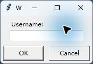

# 阶段 C 桌面客户端打包验证记录

验证日期：2026-07-18

## 构建方案

- PyInstaller 6.21.0，Python 3.13.5，Windows x64。
- 使用 `onedir` 文件夹模式，不使用单文件自解压模式。
- 最终用户双击 `WorkLens.exe`，不需要安装 Python。
- `config.ini` 位于 exe 同目录，构建产物整体通过 ZIP 和 GitHub Releases 分发。

选择 `onedir` 是为了缩短启动时间、避免每次运行解压到临时目录，并降低未签名单文件壳触发杀毒软件启发式误报的概率。

## 无 Python 模拟环境

本机没有可用的 Windows Sandbox，因此采用允许的模拟方式：把发布目录复制到独立临时目录，清除 `PYTHONHOME` 和 `PYTHONPATH`，将 `PATH` 限制为 Windows 系统目录，并为客户端设置隔离的 `LOCALAPPDATA`。

真实输出：

```text
simulated_python_on_path=False
python_runtime_path=C:\Users\29327\AppData\Local\Temp\worklens-c4-runtime\WorkLens\_internal\python313.dll
config_path=C:\Users\29327\AppData\Local\Temp\worklens-c4-runtime\WorkLens\config.ini
usage_records_before=0
usage_records_after=1
log_exists=True
cache_exists=True
```

这证明目标进程使用发布目录内的 Python DLL，而不是系统 Python，并通过 `config.ini` 连接后端，完成了真实采样和上报。

最终构建完成后，又直接解压 `WorkLens-windows-x64.zip` 并重复验证可分发产物：

```text
final_zip_python_on_path=False
final_zip_process_running=True
final_zip_python_runtime=...\WorkLens\_internal\python313.dll
final_zip_usage_before=0
final_zip_usage_after=1
final_zip_log_exists=True
final_zip_cleanup_complete=True
```

## 运行日志

为避免提交持续验证期间采集到的无关个人应用名，只保留登录、Idle 采样和首次成功上报的真实日志摘录：[worklens-runtime.log](worklens-runtime.log)

```text
2026-07-18 14:56:01 INFO Starting WorkLens desktop client. base_url=http://localhost:8080 config=...\WorkLens\config.ini
2026-07-18 14:56:01 INFO Login accepted for username=C4-EXE-001 display_name=C4 Clean Environment
2026-07-18 14:56:01 INFO Login succeeded for C4-EXE-001 (EMPLOYEE).
2026-07-18 14:56:01 INFO Startup retry complete: uploaded=0, cached=0
2026-07-18 14:56:01 INFO Running sync client. sample_interval=1s, idle_threshold=300s, upload_interval=5s.
2026-07-18 14:56:01 INFO [2026-07-18T14:56:01] sampled Idle
2026-07-18 14:56:06 INFO [2026-07-18T14:56:06] flush complete: uploaded=1, cached=0
```

打包程序真实登录窗口：



## 开机自启动

对当前用户注册表启动项执行了真实启用和关闭往返验证，验证结束后保持默认关闭：

```text
before=False
after_enable=True
after_disable=False
registry_value_removed=True
```

## 自动化测试与清理

- 桌面客户端 36 项自动化测试通过。
- PyInstaller 构建成功，发布目录包含 `WorkLens.exe`、`config.ini` 和完整运行时依赖。
- 两个验证进程、临时员工账号和隔离目录均已删除。
- exe、`build/` 和 `dist/` 均未加入 Git。
